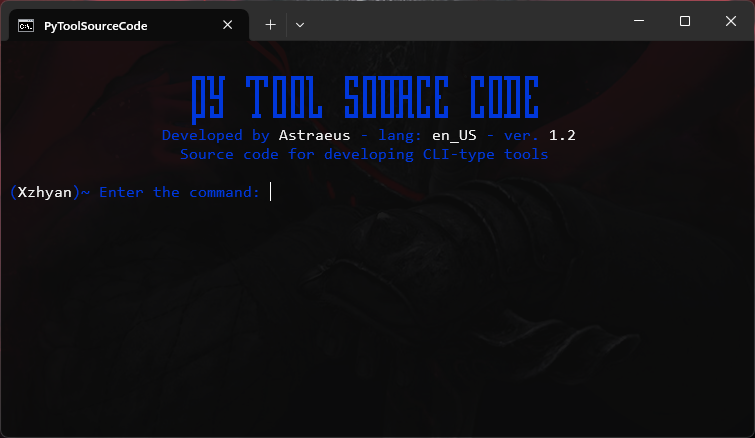

# Python Source Code para Ferramenta CLI

---

## Informações Básicas

- **Autor**: Astraeus [@xzhyan7](https://github.com/astraeus47)
- **Versão**: 1.2  
- **Idioma Padrão**: Inglês  
- **Linguagem**: Python

---

## Descrição do Projeto

Este projeto é um código-fonte para facilitar a criação de ferramentas do tipo CLI (Command Line Interface). O código já está estruturado para que você possa modificar, criar e adicionar novas funcionalidades com facilidade.  

É possível integrar códigos para automatização de tarefas no Windows ou até mesmo criar scripts voltados para a área de Hacking.

---

## Características

- Suporte a tradução de interface  
- Mensagens de alerta personalizadas  
- Banners em ASCII  
- Organização de comandos por categoria  
- Adição de novos scripts  
- Cores personalizadas no terminal  
- Login com credenciais armazenadas no sistema  
- Registro de credenciais via script  

---

## Principais Bibliotecas Python Utilizadas

- [colorama](https://pypi.org/project/colorama/)  
- [python-gettext](https://pypi.org/project/python-gettext/)  
- [keyring](https://pypi.org/project/keyring/)  

---

## Como Usar o Código-Fonte

1. Clone o repositório:

```sh
git clone https://github.com/astraeus47/PyToolSourceCode.git
```

2. Use o `install.bat` para instalar automaticamente os requisitos.

---

## Como Usar o Esquema de Tradução

O esquema de tradução utiliza a biblioteca `python-gettext` e o compilador `gettext`.  
Dentro do código, o uso de `_gettext()` indica que o texto deve ser traduzido conforme o idioma configurado.

As traduções ficam no caminho `config/locale/`, dentro de pastas nomeadas conforme o idioma (por exemplo, `pt_BR`, `en_US`).  
Cada pasta de idioma contém uma subpasta `LC_MESSAGES` com os arquivos `messages.po` (texto original e traduzido) e `messages.mo` (versão compilada).

### Etapas:

1. Baixe o compilador gettext para Windows:  
   [Download gettext for Windows](https://github.com/mlocati/gettext-iconv-windows/releases/tag/v0.23-v1.17)

2. Utilize `_gettext()` nos textos que devem ser traduzidos:

```python
print(_gettext("Exemplo de texto que será traduzido."))
```

3. Gere o arquivo `.po` com o `xgettext` (opcional):

```sh
xgettext -o messages.pot main.py
```

4. Crie o arquivo `messages.po` dentro do diretório correto (ex: `config/locale/pt_BR/LC_MESSAGES`) com o seguinte conteúdo:

```po
msgid "Hello, World!"
msgstr "Olá, Mundo!"

msgid "This is a test message."
msgstr "Esta é uma mensagem de teste."
```

5. Compile o arquivo `.po` para `.mo` com o comando:

```sh
msgfmt -o config\locale\pt_BR\LC_MESSAGES\messages.mo config\locale\pt_BR\LC_MESSAGES\messages.po
```

---

## Como Usar as Mensagens de Alerta Personalizadas

A função `alert()` exibe mensagens de alerta. Ela recebe uma tupla com o tipo e o texto da mensagem.  
Exemplo: `alert('info', "Exiting...")` ou com tradução: `alert('error', _gettext("Problema na ferramenta!"))`.

- `info`: mensagens informativas  
- `success`: mensagens de sucesso  
- `error`: mensagens de erro  

```python
if __name__ == '__main__':
    try:
        main()
    except KeyboardInterrupt:
        alert('info', _gettext("Exiting..."))
        sys.exit()
```

---

## Adicionando Novos Comandos

Os comandos devem ser adicionados a uma categoria existente ou criar uma nova.

1. No arquivo `src/settings.py`, adicione uma nova categoria:

```python
new_commands = {
    'cmd01': _gettext("comando 01"),
    'cmd02': _gettext("comando 02"),
    'cmd03': _gettext("comando 03"),
}
```

2. No arquivo `src/main.py`, adicione as condições para os comandos:

```python
def new_commands(self, args):
    if args[0] == 'cmd01':
        # Código para executar o comando 01

    elif args[0] == 'cmd02':
        # Código para executar o comando 02

    else:
        return
```

---

## Registro e Login com Credenciais Salvas

O sistema de login utiliza as credenciais salvas localmente.  
No diretório `src/scripts/`, use o script `register.py` para cadastrar credenciais:  

```sh
py register.py
```

Na tela de login, use as mesmas credenciais cadastradas.

---

### Em breve, novas atualizações...


