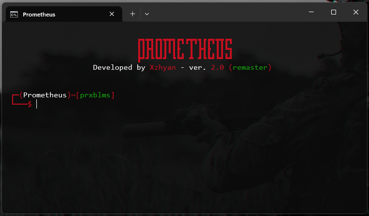
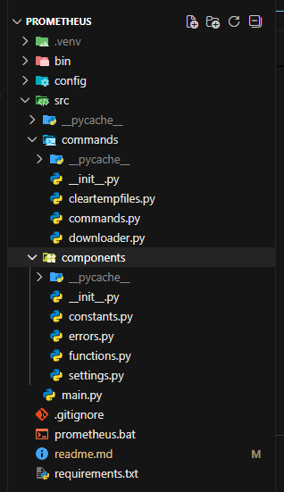

# Prometheus

> É uma ferramenta de linha de comandos (CLI), criada especificamente para ser usada em OS Windows e desenvolvida em Python.
> Tem como principal função automatizar taferas do usuário no sistema e auxiliar com novas funcionalidades.



---

## Sumário
- [Sobre](#sobre)
- [Funcionalidades](#funcionalidades)
- [Tecnologias](#tecnologias)
- [Bibliotecas usadas](#bibliotecas-usadas)
- [Requisitos](#requisitos)
- [Instalação](#instalação)
- [Uso](#uso)
- [Exemplos](#exemplos)
- [Estrutura do Projeto](#estrutura-do-projeto)
- [Roadmap](#roadmap)
- [Aviso Legal](#avis-legal)
- [Licença](#licença)
- [Autor](#autor)

---

## Sobre

A ideia do projeto surgiu da necessidade de automatizar tarefas do sistema e disponibilizar novas funções personalizadas que solucionem problemas ou, de forma simples, facilitem a vida do usuário, sem que ele precise perder tempo procurando soluções na internet. Além disso, o desenvolvimento deste projeto serve como base de aprendizado.

Ainda em fase inicial, o projeto está se desenvolvendo bem e, futuramente, ganhará uma versão voltada para Cibersegurança.

---

## Funcionalidades

- [x] Limpeza de arquivos temporários do sistema (cleartempfiles)
- [x] Download de músicas e vídeos do YouTube (downloader)
- [ ] Download de arquivos de outras Plataformas
- [ ] Atalhos personalizados
- [ ] Ferramentas de Cyber Secuity

---

## Tecnologias

- Python ver. 3.14.0

### Bibliotecas usadas
- colorama==0.4.6
- PyYAML==6.0.3
- yt-dlp==2025.12.8

---

## Requisitos

- Python >= 3.10
- Usuário Administrador
- Sistema operacional suportado:
  - Windows
  - Linux (Não suportado ainda)

---

## Instalação

```bash
git clone https://github.com/Xzhyan/Prometheus.git
cd Prometheus
py -m venv .venv
.venv\Scripts\activate
pip install -r requirements.txt
```

## Uso

Para usar pode apenas abrir o 'prometheus.bat' ou se preferir manual faça:

```bash
.venv\Scripts\activate
py src\main.py
```

## Exemplos

Para começar use o comando 'help' e a lista de comandos vai ser exibida.

## Estrutura do Projeto



## Roadmap

O projeto já possui uma estrutura sólida e algumas ferramentas úteis.
Novas funcionalidades serão implementadas em breve.
Uma versão focada em Segurança Cibernética está em desenvolvimento.

## Aviso Legal

O uso dessa ferramenta é de total responsabilidade do usuário!

## Licença

A ferramenta pode ser usada para fins de aprendizado, mas de forma alguma deve ser usada com fins lucrativos e sem autorização necessária.

## Autor

- [Xzhyan](https://github.com/Xzhyan/)
